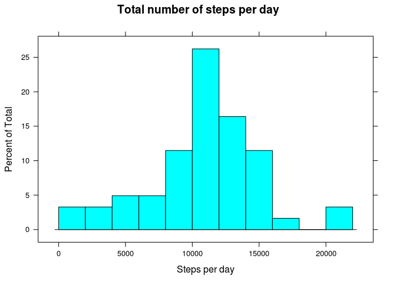
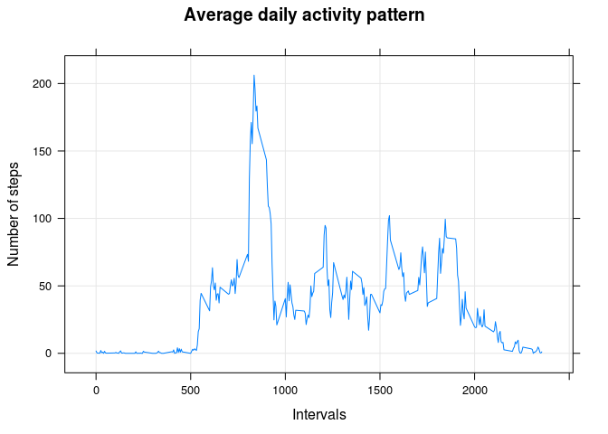
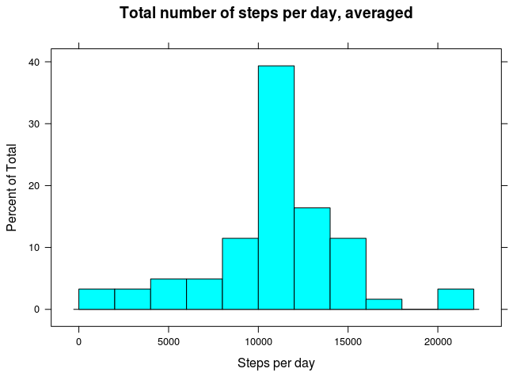
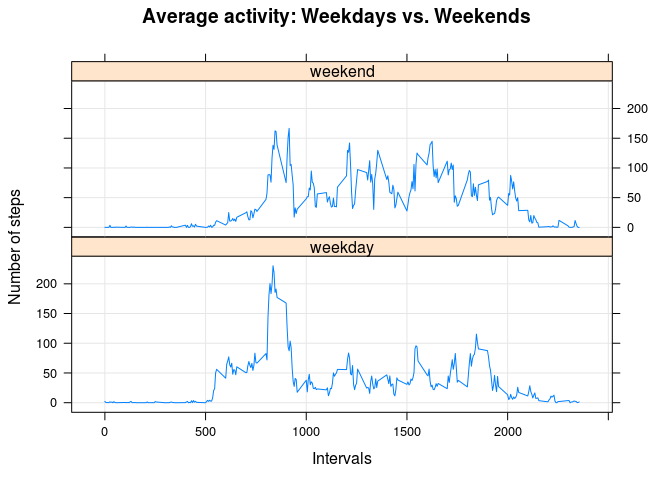

# Reproducible Research: Peer Assessment 1


## Loading and preprocessing the data

```r
## Libraries
library(lattice)

temp <- tempfile()
download.file("http://d396qusza40orc.cloudfront.net/repdata%2Fdata%2Factivity.zip",temp)
unzip(temp)
data <- read.csv("activity.csv")
unlink("activity.csv")
```
  
Sample of the dataset

```r
head(data,10)
```

```
##    steps       date interval
## 1     NA 2012-10-01        0
## 2     NA 2012-10-01        5
## 3     NA 2012-10-01       10
## 4     NA 2012-10-01       15
## 5     NA 2012-10-01       20
## 6     NA 2012-10-01       25
## 7     NA 2012-10-01       30
## 8     NA 2012-10-01       35
## 9     NA 2012-10-01       40
## 10    NA 2012-10-01       45
```


## What is mean total number of steps taken per day?
For this part of the assignment, you can ignore the missing values in the dataset.  

#### 1. Calculate the total number of steps taken per day

```r
dailyStep <- setNames(aggregate(data$steps, list(data$date), sum, na.exclude=T), c("date", "steps"))
dailyMeanStepsPerInterval <- aggregate(steps ~ interval, data, mean, na.exclude=T)
```
  
Sample of the dataset

```r
head(dailyStep,10)
```

```
##          date steps
## 1  2012-10-01    NA
## 2  2012-10-02   127
## 3  2012-10-03 11353
## 4  2012-10-04 12117
## 5  2012-10-05 13295
## 6  2012-10-06 15421
## 7  2012-10-07 11016
## 8  2012-10-08    NA
## 9  2012-10-09 12812
## 10 2012-10-10  9901
```
  
#### 2. If you do not understand the difference between a histogram and a barplot, research the difference between them. Make a histogram of the total number of steps taken each day

```r
histogram(dailyStep$steps, breaks=10, main="Total number of steps per day", xlab="Steps per day")
```

 
  
#### 3. Calculate and report the mean and median of the total number of steps taken per day  
Mean:

```r
mean(dailyStep$steps, na.rm=TRUE)
```

```
## [1] 10767.19
```
Median:

```r
median(dailyStep$steps, na.rm=TRUE)
```

```
## [1] 10766
```

## What is the average daily activity pattern?

#### 1. Make a time series plot (i.e. type = "l") of the 5-minute interval (x-axis) and the average number of steps taken, averaged across all days (y-axis)

```r
xyplot(steps ~ interval, data=dailyMeanStepsPerInterval, type="l", grid=TRUE, ylab="Number of steps", xlab="Intervals", main="Average daily activity pattern")
```

 

#### 2. Which 5-minute interval, on average across all the days in the dataset, contains the maximum number of steps?  

```r
maxInt <- dailyMeanStepsPerInterval$interval[which.max(dailyMeanStepsPerInterval$steps)]
maxInt
```

```
## [1] 835
```

## Imputing missing values
Note that there are a number of days/intervals where there are missing values (coded as NA). The presence of missing days may introduce bias into some calculations or summaries of the data.

#### 1. Calculate and report the total number of missing values in the dataset (i.e. the total number of rows with NAs)
Missing step

```r
missingValues <- sum(is.na(data$steps))
missingValues
```

```
## [1] 2304
```
Missing date

```r
sum(is.na(data$date))
```

```
## [1] 0
```
Missing interval

```r
sum(is.na(data$interval))
```

```
## [1] 0
```

#### 2. Devise a strategy for filling in all of the missing values in the dataset. The strategy does not need to be sophisticated. For example, you could use the mean/median for that day, or the mean for that 5-minute interval, etc.
We will use the averaged dataset plotted before

```r
str(dailyMeanStepsPerInterval)
```

```
## 'data.frame':	288 obs. of  2 variables:
##  $ interval: int  0 5 10 15 20 25 30 35 40 45 ...
##  $ steps   : num  1.717 0.3396 0.1321 0.1509 0.0755 ...
```

#### 3. Create a new dataset that is equal to the original dataset but with the missing data filled in.

```r
FilledDataset <- data
for(r in 1:nrow(FilledDataset)){
  if (is.na(FilledDataset$steps[r])) {
    repl <- dailyMeanStepsPerInterval$steps[dailyMeanStepsPerInterval$interval == FilledDataset$interval[r]];
    FilledDataset$steps[r] <- repl;
  }
}
```
Verification

```r
sum(is.na(FilledDataset$steps))
```

```
## [1] 0
```

#### 4. Make a histogram of the total number of steps taken each day and Calculate and report the mean and median total number of steps taken per day. Do these values differ from the estimates from the first part of the assignment? What is the impact of imputing missing data on the estimates of the total daily number of steps?

```r
dailyStepAveraged <- setNames(aggregate(FilledDataset$steps, list(FilledDataset$date), sum, na.exclude=T), c("date", "steps"))
histogram(dailyStepAveraged$steps, breaks=10, main="Total number of steps per day, averaged", xlab="Steps per day")
```

 
Mean:

```r
mean(dailyStepAveraged$steps, na.rm=TRUE)
```

```
## [1] 10767.19
```
Median:

```r
median(dailyStepAveraged$steps, na.rm=TRUE)
```

```
## [1] 10767.19
```
The mean and the median are now equals and they're not big differences with the previous values (they are now identical to the original mean, which was a little different from the original median).
The shape of the istogram is similar to the previous one, but the added steps have increased the number of steps observed around the mean (at the center of the histogram, in general): it was around 20 before, now it's around 40.


## Are there differences in activity patterns between weekdays and weekends?
For this part the weekdays() function may be of some help here. Use the dataset with the filled-in missing values for this part.

#### 1. Create a new factor variable in the dataset with two levels – “weekday” and “weekend” indicating whether a given date is a weekday or weekend day.

```r
FilledDataset$day <- "weekday"
FilledDataset$day[weekdays(as.Date(FilledDataset$date), abb=T) %in% c("sab","dom")] <- "weekend"
table(FilledDataset$day)
```

```
## 
## weekday weekend 
##   12960    4608
```

#### 2. Make a panel plot containing a time series plot (i.e. type = "l") of the 5-minute interval (x-axis) and the average number of steps taken, averaged across all weekday days or weekend days (y-axis). See the README file in the GitHub repository to see an example of what this plot should look like using simulated data.

```r
meanStepsDailyStepAveraged <- aggregate(steps ~ interval + day, FilledDataset, mean)
xyplot(steps ~ interval | day, meanStepsDailyStepAveraged, type="l", grid=T, layout=c(1,2), ylab="Number of steps", xlab="Intervals", main="Average activity: Weekdays vs. Weekends")
```

 
